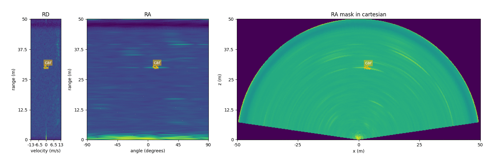
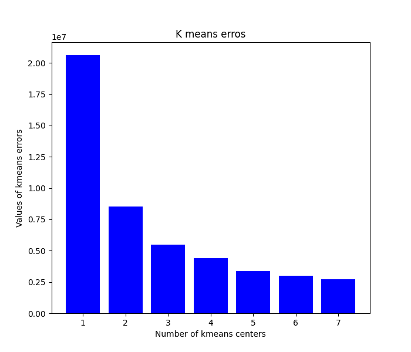
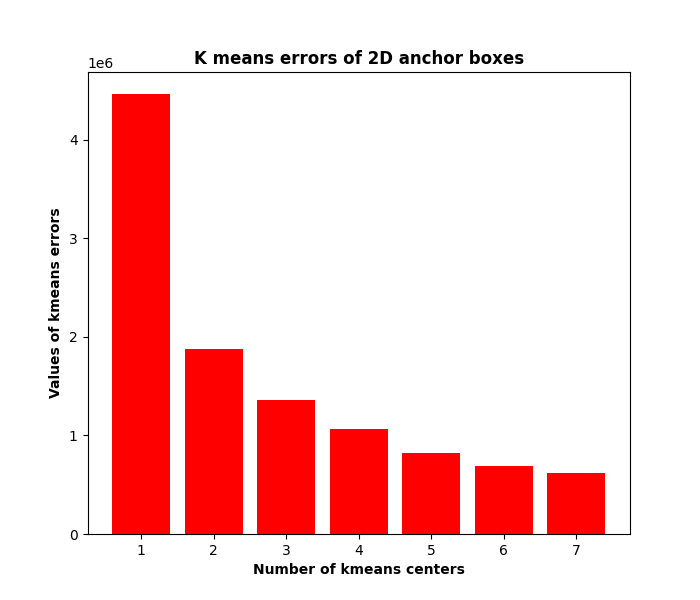
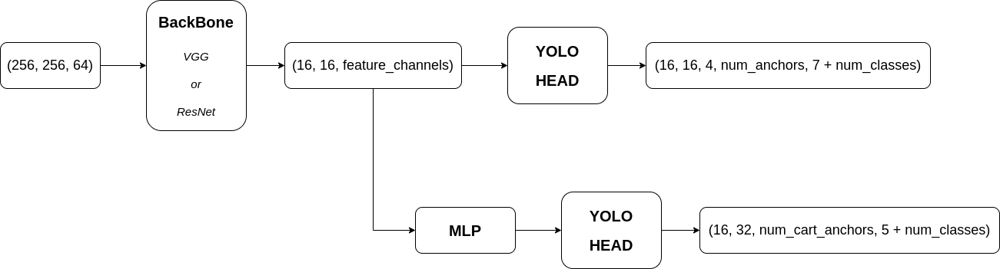
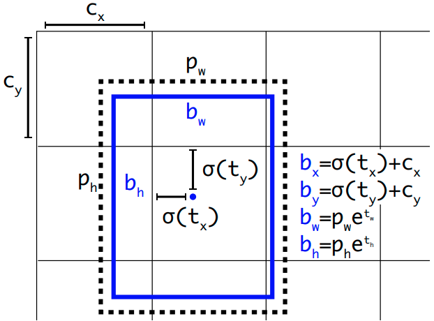
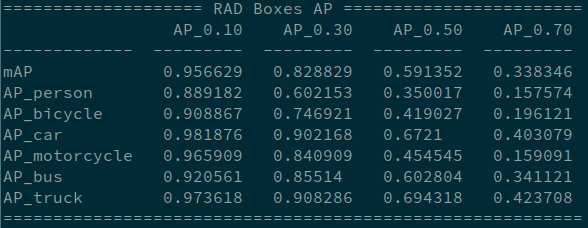
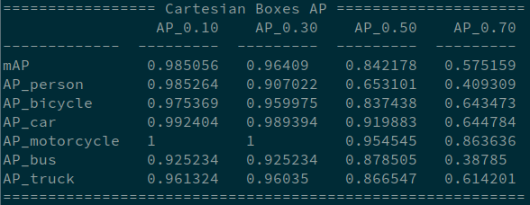
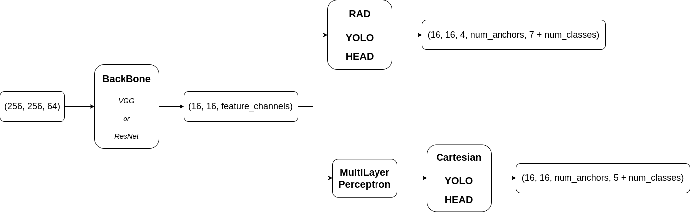

# RADDet
## Range-Azimuth-Doppler based Radar Object Detection for Dynamic Road Users
The following `.gif` is an example of the our model.
<p align="center">
  
</p>

Current State: preparing paper

## Radar(stationary) Dataset for Dynamic Road Users

> Overall View

After 1.5 months efforts with >60800 frames data capture, auto-annotation and manual correction, a stationary radar dataset for moving road users is generated. The dataset contains totally **10158** frames. Each one of them is carefully annotated, including everything that can be seen by radar but not by stereo. 

For the data capture, we used the same radar configuration through the entire research. The details of the data capture is shown below.
```
"designed_frequency":			76.8 Hz,
"config_frequency":			77 Hz,
"range_size":				256,
"maximum_range":			50 m,
"doppler_size":				64,
"azimuth_size":				256,
"range_resolution":			0.1953125 m/bin,
"angular_resolution":			0.006135923 degrees/bin,
"velocity_resolution":			0.41968030701528203 (m/s)/bin
```

The dataset has totally **6** categories, different input formats and ground truth formats. All the information that stored in the dataset can be concluded as follow.
```
ADC:		raw radar data with size (256, 8, 64)
RAD:		3D-FFT radar data with size (256, 256, 64)
images:		2 rectified stereo images
gt:		ground truth with {"classes", "masks", "boxes"}	
gt_box:		ground truth with {"classes", "boxes", "cart_boxes"}
visual:		DATASET visualization with masks and boxes
```

**Note:** the reason why there are `gt` and `gt_box` is that 3D masks (RAD masks) take huge amount of space to store.

**Also Note:** for the "classes", they are `["person", "bicycle", "car", "motorcycle", "bus", "truck" ]`.

**Also Note:** for the "boxes", the format is `[x_center, y_center, z_center, w, h, d]`.

> Statistic Analysis

We also conducted some statistic analysis on the dataset. The figure below illustrates the number of objects of each category in the whole dataset, along with maximum number of ojbects within one single frame.
<p align="center">
  
</p>
Due to the reason that most scenes are captured on either the side-walks or near the traffic lights, it appears that category "car" dominates the dataset. Still, we can see there is a good portion of the frames that have "people" inside.

Since radar is mainly a distance sensor, we also did an analysis on the range distributions. The picture shown below tells about the information.
<p align="center">
  
</p>
Ideally, the distribution should be Uniform. In really life scenario, it is hard to detect far-away objects (objects that almost reach the maxixmum range) using only 1 radar sensor. As for the objects that are too close to the radar, it becomes extremely noisy. This makes the annotation for those objects a little bit impractical.

> Dataset Link

For those who are interested in the dataset, [OneDrive](https://uottawa-my.sharepoint.com/personal/azhan085_uottawa_ca/_layouts/15/onedrive.aspx?id=%2Fpersonal%2Fazhan085%5Fuottawa%5Fca%2FDocuments%2FDATA%5Fstationary) or [GoogleDrive](https://drive.google.com/drive/folders/188OyahtGSjOHxjvobTTi36x6x2Fd1nXm?usp=sharing).

## Current State

> DONE

- Dataset splitting: **80%** goes to trainset, and **20%** goes to testset. The processing is implemented as `dataset/split_sequences.py`. As the distributions of the trainset and testset, it is concluded as follow,
```
trainset: {'person': 5210, 'bicycle': 729, 'car': 13537, 'motorcycle': 67, 'bus': 176, 'truck': 3042}
testset:  {'person': 1280, 'bicycle': 204, 'car':  3377, 'motorcycle': 21, 'bus':  38, 'truck':  720}
```

- Data visualization with input(RAD)/output(instance with mask/box):  `visualize_data.py`. A sample is shown as below,
<p align="center">
  
</p>

- Implemented `dataset/batch_data_generator.py`. It basically follow the implementation of [YOLOv4](https://arxiv.org/abs/2004.10934). But, instead using python class iterator, I used [`tf.data.Dataset.from_generator`](https://www.tensorflow.org/guide/data). It transfers raw ground truth instances to ground turth labels with the same format as YOLO HEAD output `[batch, r, a, d, anchors, 7 + num_class]`.

- Anchor boxes finding: `./dataset/anchor_kmeans.py`. Output `images/anchor_kmeans.png` for the relationship between K-means errors and number of anchors. The anchor boxes are saved as `anchors.txt`.
<p align="center">
  
</p>

- Anchor boxes finding(specifically for `cart_boxes`): `./dataset/anchor_kmeans_cartboxes.py`. Output `images/anchor_kmeans_cartboxes.png` for the relationship between K-means errors and number of anchors. The anchor boxes are saved as `anchors_cartboxes.txt`.
<p align="center">
  
</p>

- Sequence numbers should be store in `sequences.txt`. This file is the basic of data generator. To write the sequence numbers automatically into the txt file. Goto `dataset` and run `sequences.py`.

- Implemented the basic of `model/backbone_resnet3d.py`. It has `basicResidualBlock` and `bottlenetResidualBlock` as illustrated in the [ResNet](https://arxiv.org/abs/1512.03385). Implemented the basic of `model/backbone_vgg3d.py` which mimics [VGG](https://arxiv.org/abs/1409.1556). Implemented `model/head_YOLO.py`, which follows the descriptions in [YOLOv3](https://arxiv.org/abs/1804.02767). Also Implemented `model/model_cart.py` which includes a MultiLayer Perceptron for coordinates transformation and YoLo Head for 2D box regression. The overall structure can be viewed as follow.
<p align="center">
  
</p>

- As for the explaination of what the MLP mentioned above actually does, It transfers the freature maps from polar coordinates to Cartesian coordinates channel-wise. So we also call it "Coordinates Transformation MLP". An image, as shown below, is made to explain the idea more precisly.
<p align="center">
  
</p>

- Implemented `decoder` in `model/head_YOLO.py`. The decoder is currently following the descriptions in [YOLOv3](https://arxiv.org/abs/1804.02767). Details explained as the figure shown below (~/cite{YOLOv3}).
<p align="center">
  
</p>

- Implemented mean Average Precision (mAP), based on the implementation [https://github.com/Cartucho/mAP](https://github.com/Cartucho/mAP) and [my own implementation](https://github.com/ZhangAoCanada/ao_yolo). It outputs `mean_ap` and `ap_all_classes`, which are mean AP over all classes, and AP for each class. More tests and debugs needed.

- Implemented `evaluated.py`, it takes test of the target checkPoint on the entire dataset using different `mAP_iou3d_threshold`s. The values of the IoUs can be configured in `config.json`. The code also will go over the dataset and plot the predictions along with ground truth labels for visualization. At the end of evaluating, one should be able to see the AP results in the terminal directly. One screenshot is shown as below for illustrating the result format.
<p align="center">
  
  
</p>

- Implemented `inference.py`. The pridiction frames will be saved in `images/inference_plots/`. It will also print the average inference time when no more data fed in.

> TODO List

- **Go over the entire dataset to filter out some incorrect data.** And don't forget to re-view the box-only images when transferring to dataset locally before uploading (just for a double-check).

- Think: whether we should keep using **magnitude log**, or using **magnitude locally normalized** or **magnitude globally normalized**.

## Structure Thinking

> Overall Structure

Let us start from simple structures. Becase the Cartesian boxes are in the different coordinates representations, we may need to provide different networks to learn it. One thing is no matter what networks we choose to interpret the features, they shall share the same feature maps learnt from inputs. Another thing is the Cartesian boxes are actually transferred from RD boxes with a non-linear transformation. Naturally, I think MultiLayer Perceptron may be good enough in this case. Overall, the structure I am following now can be illustrated as follow.
<p align="center">
  
</p>

> Backbone

- Classic: [VGG](https://arxiv.org/abs/1409.1556), [ResNet](https://arxiv.org/abs/1512.03385), [DarkNet](https://arxiv.org/abs/1804.02767), [InceptionNet](https://arxiv.org/abs/1409.4842), [MobileNet](https://arxiv.org/abs/1704.04861).

- Mordern: [EfficientNet](https://arxiv.org/abs/1905.11946), [CSPResNeXt](https://arxiv.org/abs/1911.11929), [SCPDarknet](https://arxiv.org/abs/1911.11929), ...

- As our task is not image object detection, all the networks mentioned above may not be working under this circumstance. We may end up with designing the backbone ourselves.

> Neck

- Most stat-of-the-art Object Detection algorithms use [SPP](https://arxiv.org/abs/1406.4729) (Spatial Pyramid Pooling). We will be using that as our starting point.

- They also use [FPN](https://arxiv.org/abs/1612.03144) (Feature Pyramid Network) as multi-scale feature extraction. Some variances can be found in [EfficientDet](https://arxiv.org/abs/1911.09070). View those variances and choose one that fits this task most.

> Category Head and Box Head

- Classic: [SSD](https://arxiv.org/abs/1512.02325) and [YOLOv3](https://arxiv.org/abs/1804.02767).

- State-of-the-art: [EfficientDet](https://arxiv.org/abs/1911.09070),  [YOLOv4](https://arxiv.org/abs/2004.10934), [PP-YOLO](https://arxiv.org/abs/2007.12099).

- I personally prefer YOLO, so this would be my starting point.

- As for Box Head, the starting point would be SSD Head or YOLO Head. 

> Segmentation Head

- Classic: [SegNet](https://arxiv.org/abs/1511.00561), [U-Net](https://arxiv.org/abs/1505.04597), [FCN](https://arxiv.org/abs/1411.4038), [Mask-RCNN](https://arxiv.org/abs/1703.06870)

- State-of-the-art: [DeepLab](https://arxiv.org/abs/1901.02985) and [YOLACT++](https://arxiv.org/abs/1912.06218)

- I didn't come up with a very good idea. Currently, what I am thinking is a Encoder-Decoder like structure for generating mask. 
