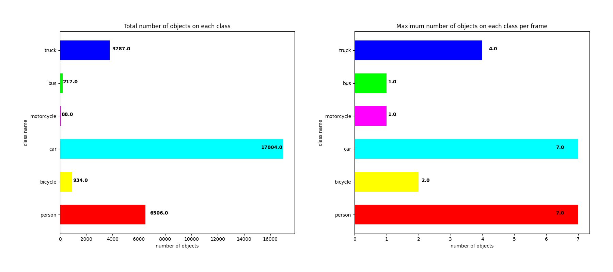
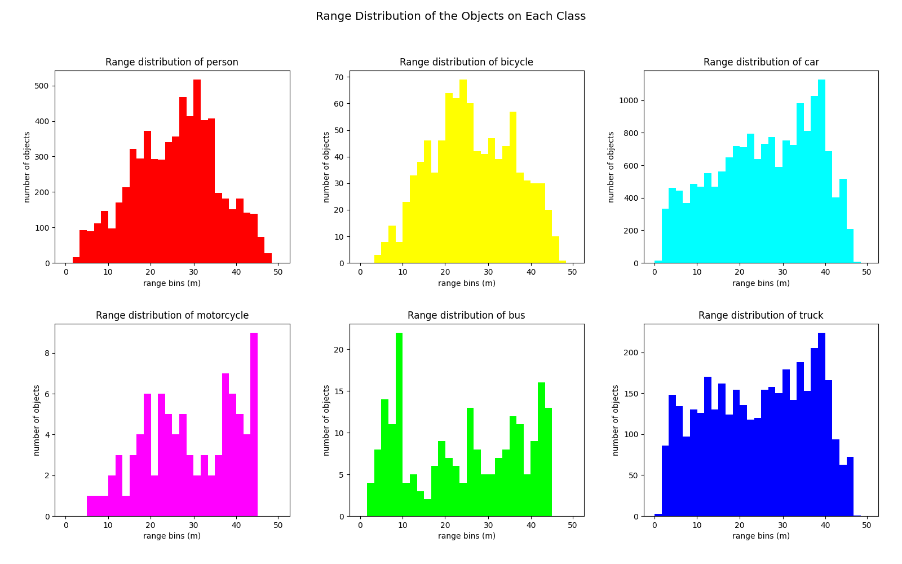
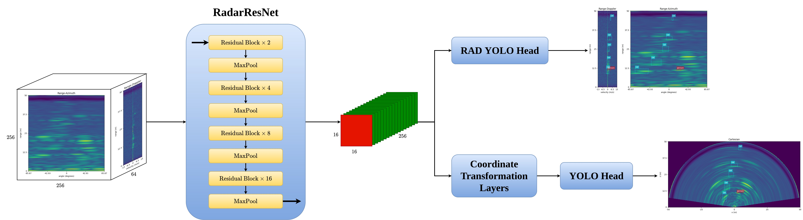

# RADDet
## Range-Azimuth-Doppler based Radar Object Detection for Dynamic Road Users
The following `.gif` contains inference samples from our model.
<p align="center">
  
</p>

## NOTICE

- Current State: preparing paper

- Announcement: we are still trying different backbone layers. Therefore, the current backbone layers may vary from the original implementations.

# List of Contents

<!--ts-->
* [Requirements](#requirements)
* [Radar Dataset](#Dataset)
	* [Dataset Link](#DatasetLink)
	* [Dataset Details](#DatasetDetails)
	* [Dataset Statistic](#statistic)
	* [Trainset & Testset](#traintest)
* [RADDet](#Core)
	* [Backbone: RadarResNet](#backbone)
	* [Dual Detection Head](#head)
* [How to use](#howtouse)
	* [Train](#train)
	* [Test](#test)
* [Pre-trained Checkpoint](#ckpt)
* [Visualization on Test set](#testsamples)
<!--te-->

# Requirements<a name="requirements"/>

Our model is developed under
```
System:				Ubuntu 18.04
Python:				3.6.9
CUDA version:			10.1
TensorFlow:			>=2.3.0
```

For all the requirements, you can simply run
```bash
$ pip install -r requirements.txt
```

# Radar(stationary) Dataset for Dynamic Road Users<a name="Dataset"/>

## Dataset Link<a name="DatasetLink"/>

For those who are interested in our dataset, [GoogleDrive](https://drive.google.com/drive/folders/1v-AF873jP8p6waChF3pSSqz6HXOOZgkC?usp=sharing) or [OneDrive](https://uottawa-my.sharepoint.com/personal/azhan085_uottawa_ca/_layouts/15/guestaccess.aspx?folderid=016d9f28644214b8c8813d618a3809365&authkey=ARvXPjc---r2wTFL6TEuY84&e=bwnfSO).

## Dataset Details<a name="DatasetDetails"/>

After 1.5 months efforts with >60800 frames data capture, auto-annotation and manual correction, a stationary radar dataset for moving road users is generated. The dataset contains totally **10158** frames. Each one of them is carefully annotated, including everything that can be seen by radar but not by stereo. 

For the data capture, we used the same radar configuration through the entire research. The details of the data capture is shown below.
```
"designed_frequency":			76.8 Hz,
"config_frequency":			77 Hz,
"range_size":				256,
"maximum_range":			50 m,
"doppler_size":				64,
"azimuth_size":				256,
"range_resolution":			0.1953125 m/bin,
"angular_resolution":			0.006135923 degrees/bin,
"velocity_resolution":			0.41968030701528203 (m/s)/bin
```

The dataset has totally **6** categories, different input formats and ground truth formats. All the information that stored in the dataset can be concluded as follow.
```
RAD:		3D-FFT radar data with size (256, 256, 64)
stereo_image:	2 rectified stereo images
gt:		ground truth with {"classes", "boxes", "cart_boxes"}
```

**Note:** for the "classes", they are `["person", "bicycle", "car", "motorcycle", "bus", "truck" ]`.

**Also Note:** for the "boxes", the format is `[x_center, y_center, z_center, w, h, d]`.

## Statistic Analysis<a name="statistic"/>

We also conducted some statistic analysis on the dataset. The figure below illustrates the number of objects of each category in the whole dataset, along with maximum number of ojbects within one single frame.
<p align="center">
  
</p>
Due to the reason that most scenes are captured on either the side-walks or near the traffic lights, it appears that category "car" dominates the dataset. Still, we can see there is a good portion of the frames that have "people" inside.

Since radar is mainly a distance sensor, we also did an analysis on the range distributions. The picture shown below tells about the information.
<p align="center">
  
</p>
Ideally, the distribution should be Uniform. In really life scenario, it is hard to detect far-away objects (objects that almost reach the maxixmum range) using only 1 radar sensor. As for the objects that are too close to the radar, it becomes extremely noisy. This makes the annotation for those objects a little bit impractical.

## Train set and Test set<a name="traintest"/>
- Dataset splitting: **80%** goes to trainset, and **20%** goes to testset. The processing is implemented as `dataset/split_sequences.py`. As the distributions of the trainset and testset, it is concluded as follow,
```
trainset: {'person': 5210, 'bicycle': 729, 'car': 13537, 'motorcycle': 67, 'bus': 176, 'truck': 3042}
testset:  {'person': 1280, 'bicycle': 204, 'car':  3377, 'motorcycle': 21, 'bus':  38, 'truck':  720}
```

# RADDet<a name="Core"/>

## Backbone: RadarResNet<a name="backbone"/>

Our backbone, RadarResNet, is developed based on [ResNet](https://arxiv.org/abs/1512.03385). Details shown as below,
<p align="center">
  
</p>

We also tried [VGG](https://arxiv.org/abs/1409.1556), which is faster but lower AP.

## Dual Detection Head<a name="head"/>

Also shown as the image above, the RADDet has two detection heads, we call it dual detection head. These heads can detection the objects on both Range-Azimuth-Doppler (RAD) tensors and Cartesian coordinates. Both heads are developed under the inspiration of [YOLOv3](https://arxiv.org/abs/1804.02767), [YOLOv4](https://arxiv.org/abs/2004.10934).

Since our inputs are RAD tensors only, we propose a Coordinate Transformation block to transform the raw feature maps from Polar Coordinates to Cartesian Coordinates. The core of it is Channel-wise Fully Connected Layers.
<!--<p align="center">-->
  <!---->
<!--</p>-->

# How to use<a name="howtouse"/>

**Attention:** Please keep the same directory tree as shown in [GoogleDrive](https://drive.google.com/drive/folders/1v-AF873jP8p6waChF3pSSqz6HXOOZgkC?usp=sharing).

Download the dataset and arrange it as the folloing directory tree,
```bash
|-- train
	|-- RAD
		|-- part1
			|-- ******.npy
			|-- ******.npy
		|-- part2
			|-- ******.npy
			|-- ******.npy
	|-- gt
		|-- part1
			|-- ******.pickle
			|-- ******.pickle
		|-- part2
			|-- ******.pickle
			|-- ******.pickle
	|-- stereo_image
		|-- part1
			|-- ******.jpg
			|-- ******.jpg
		|-- part2
			|-- ******.jpg
			|-- ******.jpg
```

## Train<a name="train"/>

Change the train directory in `config.json` as shown below,
```json
"DATA" :
{
	"train_set_dir": "/path/to/your/train/set/directory",
	"..."
}
```
Also, feel free to change other training settings,
```json
"TRAIN" :
{
	"..."
}
```

## Test<a name="test"/>

Change the test directory in `config.json` as shown below,
```json
"DATA" :
{
	"..."
	"test_set_dir": "/path/to/your/train/set/directory",
	"..."
}
```
Also, feel free to change other evaluate settings,
```json
"EVALUATE" :
{
	"..."
}
```

## Pre-trained checkpoint<a name="ckpt"/>

Pre-trained `.ckpt` for RADDet is available at [CheckPoint](https://drive.google.com/drive/folders/1EZQtcAUzVKYmYHDuiiV_FB5Obk7PbSoE?usp=sharing)

After downloading `.ckpt`, create a directory `./logs` and put the checkpoint file inside it.

## Visualization of performance on Test set<a name="testsamples"/>

The following figure shows the performance of our model on Test set. Last row shows the common types of false detections that found during the test.
<!--<p align="center">-->
  <!---->
<!--</p>-->
<p align="center">
  
</p>
